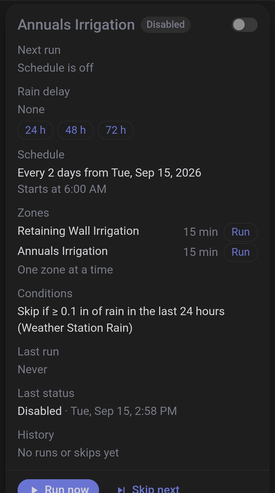

# Irrigation Manager

[](https://hacs.xyz/docs/faq/custom_repositories)
[](https://github.com/ljmerza/irrigation_manager/actions/workflows/validate.yaml)
[](https://github.com/ljmerza/irrigation_manager/actions/workflows/tests.yaml)
[](https://github.com/ljmerza/irrigation_manager/releases)

Home Assistant custom integration for scheduled watering of `valve` and `switch` entities. Each schedule has zones, a frequency, a start time, and optional rain, forecast, temperature, wind, occupancy and soil-moisture conditions. A sidebar panel shows every schedule with its controls.

One config entry = one schedule. Add as many schedules as you want.

## Install

### HACS (custom repository)

1. In HACS, open **⋮ → Custom repositories**, add `https://github.com/ljmerza/irrigation_manager` with category **Integration**.
2. Install **Irrigation Manager** and restart Home Assistant.
3. **Settings → Devices & services → Add integration → Irrigation Manager**.

Requires Home Assistant 2025.1 or newer. The integration's icon is shipped in the package and shows on 2026.3 or newer.

### Manual

Copy or bind-mount `custom_components/irrigation_manager` into `<config>/custom_components/irrigation_manager`, restart Home Assistant, then **Settings → Devices & services → Add integration → Irrigation Manager**.

Docker bind mount example:

```yaml
- /path/to/irrigation_manager/custom_components/irrigation_manager:/config/custom_components/irrigation_manager
```

## Adding a schedule

**Settings → Devices & services → Add integration → Irrigation Manager**, or **Add schedule** in the panel, opens a menu:

| Option | What it does |
|---|---|
| **Create manually** | Goes through the setup steps below. |
| **Import legacy helpers** | Reads the old watering helpers (`input_text.drip_irrigation_schedule` such as `06:00 2d 30m`, `input_number.rain_threshold`, `input_datetime.drip_irrigation_last_run` and related helpers) and pre-fills the steps. You still choose the zones. See [docs/migration.md](docs/migration.md). |
| **Import B-Hyve program** | Lists the programs on B-Hyve devices (`sensor.*_program_a`–`_d`) and pre-fills a schedule from one. Odd/even-day and one-time programs can't be imported. The last step has a **Turn off this program on the device** checkbox, off by default; the device's program switch is only turned off when you tick it. |
| **Describe in words** | Shown when an `ai_task` entity exists. The AI task turns your description into settings that pre-fill the steps. Nothing is saved until you finish the steps; values the setup wouldn't accept are dropped and listed. |

### Setup steps

1. **Name**.
2. **Zones**: one or more `valve.*` / `switch.*` entities.
3. **Run time** in minutes per zone (1–180). With more than one zone, choose **sequential** (one after another) or **concurrent** (all at once).
4. **Frequency**: every N days from a first-run date, chosen days of the week, or every N hours between a first and last run time each day.
5. **Start time**: a fixed time, or relative to sunrise/sunset. For sunrise/sunset the offset is when watering **finishes**: start = event − total run time − offset. A negative offset finishes after the event. Sun times come from Home Assistant's configured location. Not asked for every-N-hours schedules, which start at the first run time.
6. **Conditions**: any combination, each with its own step (see below), plus **stale sensor hours**.
7. **AI report**: shown when an `ai_task` entity exists; every field is optional.

**Every N hours** runs every day at the first run time, then every N hours while the start is no later than the last run time. The last run time only gets a run when the hours line up: 06:00 every 3 hours until 18:00 runs at 06:00, 09:00, 12:00, 15:00 and 18:00; until 17:00 the last run is at 15:00. Conditions are checked before every run. Moisture *trigger* mode can't be used with it, because every day is already a schedule day.

Everything except the per-zone run time numbers can be changed later with **Configure** on the entry. Changing which zones are in a schedule reloads the entry and interrupts an active run.

## Conditions

Conditions are checked at each scheduled start. When several would skip, the status shows the first of: rain, forecast, temperature, wind, occupancy, soil moisture. A condition whose sensors have no usable reading doesn't skip, except soil moisture set to skip when there are no readings.

### Rain

- **Sensors**: one or more precipitation sensors, for example your own station plus neighbour stations. Totals come from recorder statistics, or state history for sensors without statistics.
- **Threshold** (0.01 or more, in the sensor's unit) and **window**: the last N hours, or **since the last watering** with a maximum number of hours. Without a previous watering the last N hours are used.
- **Several sensors**: **max** (any station at or over the threshold), **median**, or **quorum** (at least K stations at or over the threshold). Stations without data don't count.
- **Automatic rain delay**: after a run is skipped for rain, skip scheduled runs for N more hours (0 = off). A longer delay that is already set is kept.
- **Stop a run when rain starts**: stops an active run when a rain sensor rises by at least the given amount since the run started (status `stopped_rain`). Applies to manual runs too.

### Forecast

- **Weather entities**: one or more. Hourly forecasts are used when the entity has them, otherwise twice-daily, otherwise daily.
- **Mode**: rain chance, rain amount, either, or both, over the next N hours. The amount threshold is in Home Assistant's precipitation unit. Twice-daily and daily amounts that only partly overlap the window count in proportion.
- **Entities that must agree**: with several weather entities, how many must reach the limit before a run is skipped.

### Temperature

- Skip when the current temperature, or the forecast low over the next N hours, is at or below a **minimum** (freeze), or when the current temperature is at or above a **maximum** (heat).
- Reads a temperature sensor, the weather entities' forecast, or both. Limits are in the sensor's unit, or Home Assistant's temperature unit when there is no sensor.

### Wind

Skip when a wind sensor's average over the last N minutes is at or above a maximum. The average comes from 5-minute statistics, or the current state when there are none.

### Occupancy

- **Entities** (binary sensors, input booleans, switches): `on` means someone is in the yard, for example a Frigate person occupancy sensor.
- **Delay**: re-check every 2 minutes up to a maximum delay, then skip (`skipped_occupancy`). **Skip**: skip right away.
- **Stop during run**: stop an active run when an entity turns on (`stopped_occupancy`).

### Soil moisture

- One or more sensors. "Dry" means **any** sensor reads below the threshold.
- *Skip* mode: schedule days water only when dry. Choose whether to water or skip when no sensor has a reading.
- *Trigger* mode: schedule days water as usual, and any other day also waters at the start time when dry ("every N days or moisture under X %"). The other conditions still apply to those runs.

### Stale sensor hours

Ignore the temperature sensor's reading if it hasn't reported for this many hours (0 = off). Doesn't apply to rain, wind or moisture sensors, which don't report while their value stays the same.

## Run time per device

Core `valve.open_valve` and `switch.turn_on` take no duration, so the integration picks a driver per entity from its platform:

| Platform | Start | Device stops itself |
|---|---|---|
| `orbit_bhyve` | `orbit_bhyve.start_watering` (seconds) | yes |
| `rachio` | `rachio.start_watering` (minutes) | yes |
| `rachio_local` | `rachio_local.turn_on` (seconds) | yes |
| anything else | `valve.open_valve` / `switch.turn_on` | no |

When a zone's time is up, what happens depends on the driver:

- **Device stops itself:** the integration does not send a close right away, because some firmware treats a close of an already-closed valve as a new run. 10 seconds after the zone's end it asks Home Assistant for a fresh device read (`homeassistant.update_entity`) and checks the entity; if it still reads open, it checks once more 10 seconds later, and only then sends a close. Without `homeassistant.update_entity` it polls the entity state every 5 seconds for up to 30 seconds instead. A zone that closed on its own is recorded with `stopped_by: device` in the run's zone results.
- **Anything else:** a close/turn-off is sent when the time is up.

Every close is verified against the entity state (with a fresh device read when available): the zone counts as closed only when the entity reads closed/off within 15 seconds. A zone that still reads open is treated as a failed close. A manual stop, a stop for rain or occupancy, a shutdown and a restart recovery send a close too, verified the same way — but never to a zone that already reads closed. Active zones are closed when Home Assistant shuts down, and a run interrupted by a restart has its zones closed on the next start.

If a close fails or the zone still reads open, the zone stays on the schedule's list of unclosed zones and closing is retried: when the entity becomes available again, after 1, 5 and 15 minutes, then every 15 minutes. Each retry reads the entity first: a zone that now reads closed is taken off the list without a command, and two closes are never sent within 15 seconds of each other. The list survives a restart. Before a run opens a zone that is still unclosed it tries to close it; if that fails, the zone is not started. The **Problem** binary sensor and a red banner in the panel show unclosed zones.

Zones on the same Rachio controller can't run concurrently — Rachio stops the other zones when one starts.

## Rain delay, pause and manual runs

- **Rain delay**: scheduled runs are skipped until it ends (`skipped_rain_delay`). Set it from the panel (24, 48 or 72 hours from now), with the `set_rain_delay` service, or automatically after a rain skip. The **Clear rain delay** button, the panel's **Clear** or `hours: 0` clears it.
- **Pause all**: scheduled runs of every schedule do nothing until **Resume all**. Active runs keep going, and the next run time stays visible.
- **Run one zone**: runs a single zone for a number of minutes, ignoring conditions.
- **Check now**: shows what the conditions say right now, without running or recording anything. An active rain delay or pause is listed separately, because it isn't part of the condition result.

## AI report (optional)

Set in the **AI report** step:

- **AI task entity**, for example `ai_task.claude_ai_task` or `ai_task.ollama_ai_task_gemma3`.
- **Notification**: `persistent_notification.create` or a `notify.*` service.
- **Weekday and time**: the report is sent weekly at that local time. Leave them empty for no weekly report.
- **Camera** and **LLM Vision provider** (optional): a camera snapshot is analysed with `llmvision.image_analyzer` for signs of lawn or garden stress, and the answer is added to the report.

The report sends the schedule's settings, run and skip history, rain totals, moisture readings and next run to the AI task. Reports can also be generated from the panel (**Weekly report**, **Explain skips**) or with the `generate_report` and `explain_skips` services. AI never changes a schedule. A cloud AI task sends this data to its provider; a local one, such as Ollama, keeps it on your network.

## Entities (per schedule)

| Entity | Purpose |
|---|---|
| `switch.<schedule>_enabled` | Enable/disable automatic runs |
| `sensor.<schedule>_status` | Last status (values below). Attributes: `details` (measured values), `skip_next`, `paused`, `rain_delay_until`, `unclosed_zones`, `last_status_at` |
| `sensor.<schedule>_next_run` | Next start; `scheduled: false` means a moisture check day |
| `sensor.<schedule>_rain_delay` | End of the active rain delay; unknown when there is none |
| `sensor.<schedule>_last_run` | Last run start; per-zone results in attributes |
| `sensor.<schedule>_last_run_total` | Minutes watered in the last run |
| `sensor.<schedule>_current_zone` | Zone running now |
| `binary_sensor.<schedule>_problem` | On while a zone couldn't be closed, or when the status is `error`. Attributes: `unclosed_zones`, `zone_errors` |
| `number.<schedule>_<zone>_run_time` | Per-zone minutes |
| `button.<schedule>_run_now` / `_skip_next_run` / `_stop` / `_clear_rain_delay` | Manual controls |

Status values: `idle`, `running`, `disabled`, `paused`, `skipped_rain`, `skipped_forecast`, `skipped_temperature`, `skipped_wind`, `skipped_occupancy`, `skipped_moisture`, `skipped_rain_delay`, `skipped_manual`, `skipped_busy`, `stopped_rain`, `stopped_occupancy`, `interrupted`, `error`.

## Services

Every per-schedule service takes `config_entry_id`.

| Service | Fields | Response |
|---|---|---|
| `irrigation_manager.run_now` | optional `minutes` (1–180, overrides every zone; ignores conditions) | schedule state (optional) |
| `irrigation_manager.skip_next` | `skip` (default true; false clears) | schedule state (optional) |
| `irrigation_manager.stop` | — | schedule state (optional) |
| `irrigation_manager.set_rain_delay` | `hours` (0–336; 0 clears) | schedule state (optional) |
| `irrigation_manager.run_zone` | `zone` (entity id), optional `minutes` (default: the zone's minutes) | schedule state (optional) |
| `irrigation_manager.set_enabled` | `enabled` | schedule state (optional) |
| `irrigation_manager.evaluate` | — | condition check result (required) |
| `irrigation_manager.get_history` | optional `limit` (1–100) | `history` (required) |
| `irrigation_manager.pause_all` | no fields | — |
| `irrigation_manager.resume_all` | no fields | — |
| `irrigation_manager.stop_all` | no fields | — |
| `irrigation_manager.generate_report` | optional `days` (1–90, default 7) | `text` (optional) |
| `irrigation_manager.explain_skips` | optional `days` (1–90, default 7) | `text` (optional) |

## Events, device triggers and conditions

Runs, zones, skips, rain delays and pause changes fire an `irrigation_manager_event` event with `entry_id`, `device_id`, `name` and `type`, plus fields for that type:

| `type` | Extra fields |
|---|---|
| `run_started` | `manual`, `zones` |
| `zone_started` | `zone`, `ends_at` |
| `zone_finished` | `zone`, `minutes`, `error` |
| `run_finished` | `status`, `total_minutes` |
| `skipped` | `status`, `details` |
| `rain_delay_set` | `rain_delay_until` (null when cleared) |
| `paused` / `resumed` | — |

In the automation editor, a schedule's device offers a **trigger** for each event type above and the **conditions** is running, is enabled, is paused and rain delay active.

## Blueprints

`blueprints/automation/irrigation_manager/` contains:

- `notify_on_skip_or_error.yaml`: run notification actions when a schedule skips or a run ends with an error.
- `stop_while_entity_on.yaml`: while an entity is on (for example a person sensor), stop the schedule's run and turn the schedule off; turn it back on after the entity has been off for N minutes, also after a restart or automation reload. It turns the schedule back on even if you had turned it off yourself.
- `skip_next_when_entity_on.yaml`: at a set time each day, set skip-next when an entity is on.

To install, copy the files into `<config>/blueprints/automation/irrigation_manager/`, reload automations (or restart), then create automations from them under **Settings → Automations & scenes → Blueprints**.

## Voice

Assist intents: run now (optionally for N minutes), skip next, stop, and status, matched by schedule name. They are only offered to assistants that have entities of the valve or switch domain exposed, and **run now** refuses when none of the schedule's zones is exposed to the assistant that asked. Example custom sentences for the built-in assistant: [docs/assist.md](docs/assist.md).

## Diagnostics

**Settings → Devices & services → Irrigation Manager → ⋮ → Download diagnostics** gives the schedule's config (with the notification service redacted), current state, history and the driver chosen for each zone.

## Sidebar panel

An admin-only **Irrigation** entry in the sidebar lists every schedule:

- status, next and last run, schedule and condition summaries, last status details, and the running zone with a countdown
- a red banner for zones that couldn't be closed
- rain delay with 24 / 48 / 72 hour presets and **Clear**
- **Pause all**, **Resume all** and **Stop all**, with a banner while schedules are paused
- **Run now**, **Skip next**, **Stop**, the on/off switch, and a **Run** button per zone that asks for minutes
- **Check now**, showing the current condition readings
- history: the last 10 runs and skips, **Show more** for up to 100
- **Weekly report** and **Explain skips** when an AI task entity is configured; the text opens in a dialog

**Add schedule** and **Edit** open Home Assistant's own setup and options flows.



## Migration

Importing the legacy watering helpers and B-Hyve programs, and retiring the old Node-RED flows: [docs/migration.md](docs/migration.md).

## Limits

- Per-zone run time is capped at 180 minutes (Rachio's API limit).
- A run whose start time passed while Home Assistant was down is not made up.
- A rain delay applies to this integration's schedules only. It is not sent to the device's own program, so a program running on a B-Hyve or Rachio device is unaffected.
- Stale sensor hours applies to the temperature sensor only.
- The forecast rain amount threshold is in Home Assistant's precipitation unit, not the weather entity's.
- Assist intents are only offered to assistants with the valve or switch domain exposed.
- The rain, moisture, temperature and wind sensor pickers only list sensors with the matching `device_class`.
- AI reports depend on the model behind the AI task; check them before acting on them.
- An every-N-hours window can't cross midnight. A run that is still going when the next start comes up makes that start a skip (`skipped_busy`).

## Development

```bash
python3 -m pytest -q -p no:cacheprovider      # needs pytest-homeassistant-custom-component
cd frontend && npm run build                  # rebuilds custom_components/irrigation_manager/www/irrigation-manager-panel.js
```
